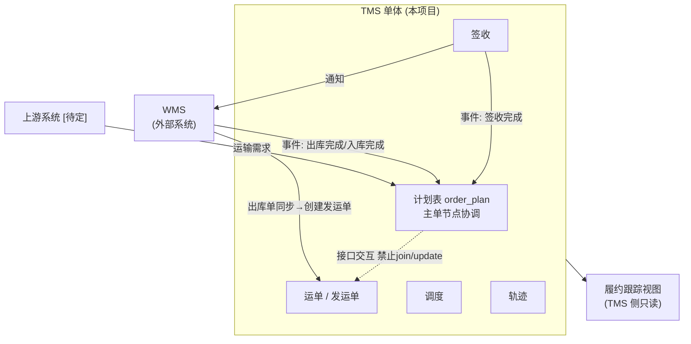

# 00 项目总览

## 目录

- [1. 背景](#1-背景)
- [2. 目标](#2-目标)
- [3. 范围](#3-范围)
- [4. 非目标](#4-非目标)
- [5. 总体架构形态](#5-总体架构形态)
- [6. 演进原则](#6-演进原则)
- [7. 读者与协作](#7-读者与协作)

---

## 1. 背景

**本项目的建设对象只有 TMS（运输单体）**：

- TMS：本项目开发、部署、演进。`[已决策]`
- WMS（仓储）：外部系统，本项目不开发，只约定集成契约（出库单同步、完成类事件）。`[已决策：ADR-003]`
- 结算等其他外部系统：对接方案 `[待定]`，**不在本套文档范围**。
- 团队规模与运维能力不足以支撑统一订单中心 → **先不建订单中心**；TMS 内设计划表承载主单协调，未来可迁出（[09](09-migration-order-center.md)）。`[已决策]`

## 2. 目标

1. TMS 完成**运输执行**主链路：承接运输需求（计划表）→ 发运 → 调度 → 轨迹 → 签收。
2. 与外部系统（WMS/上游）**松耦合、可失败**：任何一方故障或延迟不阻塞 TMS 主流程，TMS 也不阻塞对方。
3. 以全局**业务单号 + 行号**作为跨系统关联键，保证单据全链路可追溯。
4. 为未来订单中心保留**低成本迁移路径**（计划表迁出即可，运单表不动）。
5. 文档先行：本套 Markdown 为 TMS 开发基线，可随项目演进持续修订。

## 3. 范围

| 在范围内 | 说明 |
|---|---|
| TMS 单体 | 计划表、运单/发运单、调度、轨迹、签收 |
| 司机小程序 | uni-app（Vue3+TS）：任务接单、定位/节点回传、签收登记 |
| 计划表协调机制 | 四节点状态、事件幂等消费、与运单表的接口隔离 |
| WMS 集成契约 | 事件语义、幂等/重试（[06-api-contracts.md](06-api-contracts.md)） |
| 履约跟踪视图 | TMS 侧只读聚合，服务客服/运营 |

| 不在范围 | 处理方式 |
|---|---|
| WMS 系统建设 | 外部系统；本文档仅保留集成边界（[03](03-domain-boundaries.md)）与契约要求 |
| 结算等其他外部系统对接 | 方案 `[待定]`，确定后另行立文档/ADR |
| 计费/运费功能 | **移出范围，后续单独规划**（ADR-017） |
| 上游系统名称与对接方式 | `[待定]`（接口契约已先行定义，见 [06](06-api-contracts.md)） |
| 统一订单中心 | 未来演进（[09](09-migration-order-center.md)） |
| 具体技术栈/中间件 | 全文 `[待定]`，立项后另行选型（[ADR-016]） |

## 4. 非目标

1. **不建设 WMS**：其内部架构、模块、表结构不在本套文档管理范围；若未来建设归属变化，须重新立项并修订 ADR。
2. **不约定结算等其他外部系统**的对接方案（`[待定]`，确定后补 ADR）。
3. **不做微服务化**：TMS 为一个单体，内部按业务域分包；全系统只保留 `tms-plan` ↔ `tms-core` 一条模块边界（[ADR-001/004/018]）。
4. **不把计划表做成全链路状态机**：只监控四个关键节点（[ADR-007]）。
5. **不追求实时一致性**：跨系统数据交换接受最终一致。
6. **不在本期引入 MQ/事件总线**：接口按事件语义设计、HTTP 承载，保留平滑迁移能力（[ADR-010]）。
7. **不建设计费/运费功能**：移出范围、后续单独规划（[ADR-017]）。

## 5. 总体架构形态

## 6. 演进原则

| 原则 | 含义 |
|---|---|
| 临时方案不写成永久架构 | 计划表、HTTP 事件均为当前阶段合理选择，处处标注升级路径 |
| 集成必须幂等可重放 | 任何跨系统数据流动都要有幂等键与丢失检测手段 `[待定]` |
| 能不拆就不拆 | 引入任何中间件/拆分都要有实际问题支撑，写进 ADR |
| 外部系统边界克制 | 对 WMS 只提"必须提供什么"，不规定"内部怎么做" |

## 7. 读者与协作

- 决策依据：[01-architecture-decisions.md](01-architecture-decisions.md)。
- TMS 模块边界与 WMS 集成规则：[03-domain-boundaries.md](03-domain-boundaries.md)。
- 联调与测试：[04-core-flows.md](04-core-flows.md)、[06-api-contracts.md](06-api-contracts.md)。
- 红线与风险：[10-risk-and-redlines.md](10-risk-and-redlines.md)。
- 开发排期：[12-execution-plan.md](12-execution-plan.md)。
