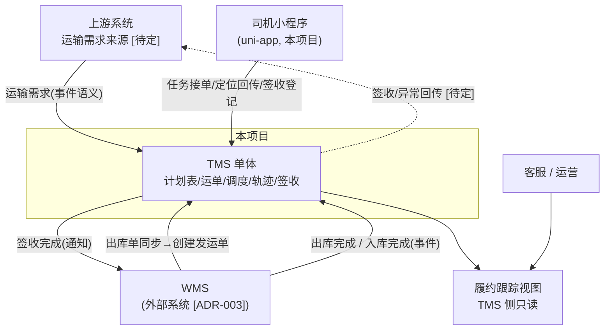
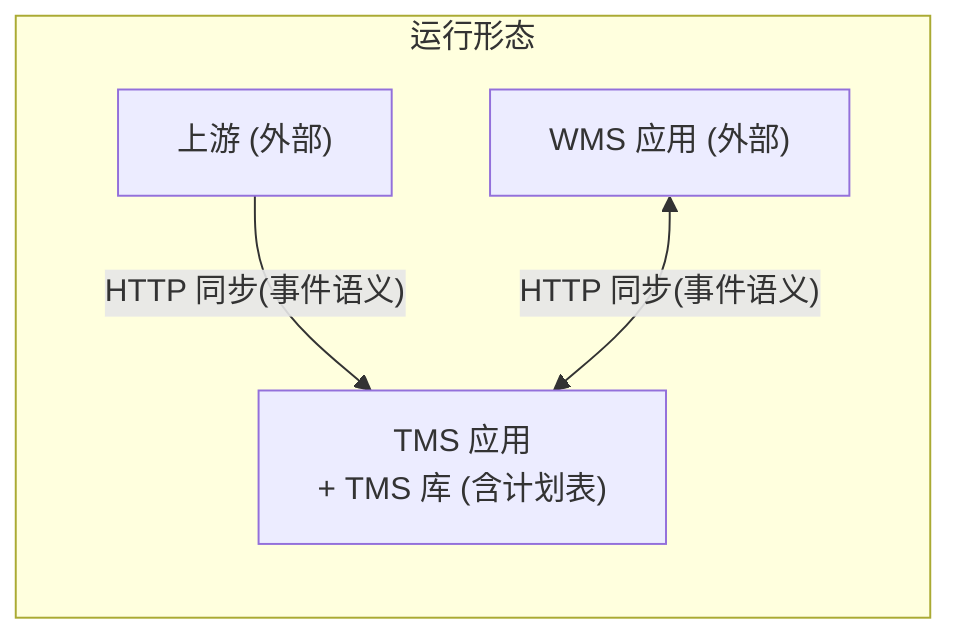

# 02 系统上下文

## 目录

- [1. 上下文图](#1-上下文图)
- [2. 系统职责矩阵](#2-系统职责矩阵)
- [3. 跨系统交互清单](#3-跨系统交互清单)
- [4. 数据主权](#4-数据主权)
- [5. 部署与运行视图](#5-部署与运行视图)
- [6. 外部依赖](#6-外部依赖)

---

## 1. 上下文图

实线 = 已确定的集成通道；虚线 = `[待定]` 或可选通道。

> WMS 部署形态 `[待定]`：单实例多仓（发货仓/目的仓为逻辑仓库）或按仓独立部署。本文档按**同一套 WMS 系统、多仓库组织**描述；若按仓部署，事件契约不变，仅路由方式不同。
> 结算等其他外部系统的对接 `[待定]`，不在本套文档范围（[ADR-003]）。

## 2. 系统职责矩阵

| 系统 | 核心职责 | 主数据（主权） | 对外关键节点 |
|---|---|---|---|
| **TMS（本项目）** | 运输执行、调度、轨迹、签收；**计划表**承载主单协调；司机端为 uni-app 小程序 | 运单、发运单、计划表 | 下发、出库完成、入库完成、签收完成 |
| WMS（外部） | 出入库作业、库存、库位、批次、盘点 | 库存、库位、批次、出入库单 | 出库完成、入库完成 |

> 结算等其他外部系统职责与对接方案 `[待定]`，确定后补充本矩阵。

## 3. 跨系统交互清单

| # | 调用方 → 被调方 | 交互 | 类型 | 失败影响与兜底 | 依据 |
|---|---|---|---|---|---|
| I-1 | 上游 → TMS | 下发运输需求，写计划表（下发节点） | 事件语义 | 重试；丢失经数据比对发现 `[待定]` | [ADR-010/011] |
| I-2 | WMS(发货) → TMS | 同步出库单，创建发运单 | 同步命令（幂等） | **不阻塞 WMS 出库**；本地事件表重试 | [ADR-003/014] |
| I-3 | WMS(发货) → TMS | 出库完成 | 事件语义 | 重试 | [ADR-010/011] |
| I-4 | WMS(目的) → TMS | 入库完成 | 事件语义 | 重试 | [ADR-003/010] |
| I-5 | TMS → WMS(发货) | 签收完成通知 | 事件语义 | 重试；WMS 侧仅作闭环参考，不反向阻塞运输 | [ADR-010] |
| I-6 | TMS 内部 | 计划表 ↔ 运单/发运单 | 进程内接口 | 禁止 join / 跨表 update | [ADR-006]（红线） |
| I-7 | 履约视图 ← TMS | 只读聚合主单与运输状态 | 查询 | 只读，无业务影响 | [03] §5 |
| I-8 | 任意系统 → 其余系统 | 订单取消 / 订单变更事实广播 | 事件语义 | 谁先收到谁发出；各方按自身状态处理 | [04] 流程6 |
| I-9 | 司机小程序 → TMS | 任务接单、定位/节点回传、签收登记 | 同步 API + 事件语义 | 重试 | [ADR-010] |

> 交互契约（信封字段、事件字典、幂等、重试）统一定义在 [06-api-contracts.md](06-api-contracts.md)；任何新增跨系统交互必须先补契约再开发。

## 4. 数据主权

| 数据实体 | 主权系统 | 其他系统获取方式 | 禁止 |
|---|---|---|---|
| 库存、库位、批次、出入库单 | WMS | 事件（完成类）+ 查询 API | 直连 WMS 库 |
| 运单、发运单、调度、轨迹、签收 | TMS | 查询 API | 外部系统直连 TMS 库 |
| 计划表（主单节点状态） | TMS（`[未来演进]` 迁订单中心） | 履约视图只读 | 外部系统直接写计划表 |
| 业务单号 + 行号 | 全局统一规则，源头系统生成 `[待定]` | 所有系统必须存储 | 各系统自造关联键 |

## 5. 部署与运行视图

- **建设范围仅 TMS 应用及其库**；WMS/上游应用由其建设方负责（[ADR-003]）。
- 基础设施（容器化、网关、鉴权、监控）`[待定]`（[ADR-016]）。

## 6. 外部依赖

| 依赖 | 用途 | 状态 |
|---|---|---|
| 上游需求系统 | 运输需求来源 | 接口直连（契约已定义，见 [06]）；系统名称与对接方式 `[待定]`（D-8） |
| GPS 定位平台 | 在途轨迹 | `[待定]`：平台选型（D-7） |

外部依赖落定前，TMS 轨迹/签收模块按"人工录入 + 接口预留"设计，不阻塞主链路。
