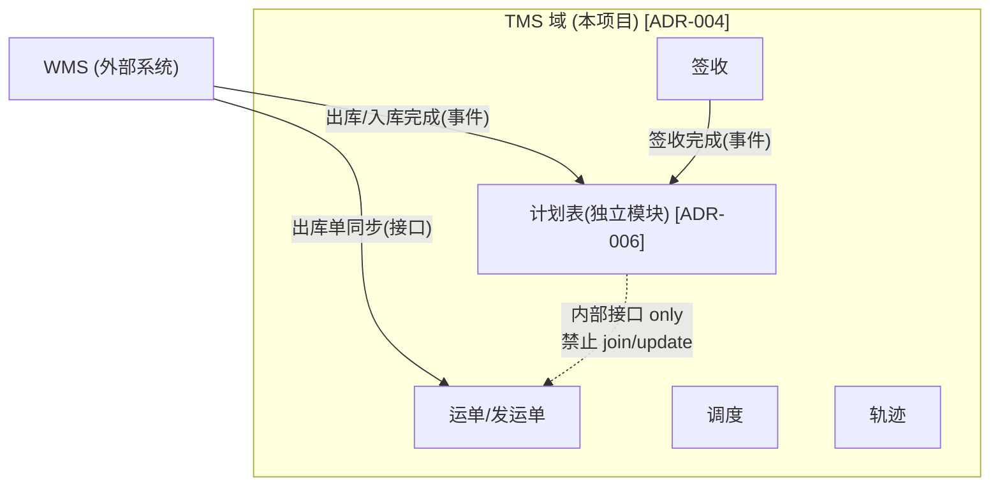

# 03 TMS 领域边界与外部系统集成边界

## 目录

- [1. 总览](#1-总览)
- [2. TMS 域（本项目建设对象）](#2-tms-域本项目建设对象)
- [3. WMS（外部系统）集成边界](#3-wms外部系统集成边界)
- [4. 跨系统依赖矩阵](#4-跨系统依赖矩阵)
- [5. 履约跟踪视图](#5-履约跟踪视图)

---

## 1. 总览

**边界第一原则**：TMS 一个单体一个库；对外只走 [02] §3 交互清单中的通道。WMS 内部如何建设，本项目不约定、不依赖（[ADR-003]）；结算等其他外部系统对接 `[待定]`。

## 2. TMS 域（本项目建设对象）

### 2.1 领域清单 `[ADR-004]`

> **领域 ≠ 模块**（2026-10-05 起，[ADR-018]）。下表是**业务领域**的划分；落到代码上，
> 除**计划表**是独立 Maven 模块（`tms-plan`）外，其余各领域都是 `tms-core` 内的子包，
> 直接互相调用，不设接口边界。

| 领域 | 职责 | 备注 |
|---|---|---|
| **计划表** | 主单四节点状态协调（下发/出库完成/入库完成/签收完成）、事件幂等消费、对外提供主单状态 | **独立模块 `tms-plan`**，与运输执行隔离 [ADR-006]；订单中心雏形 [ADR-015] |
| 运单/发运单 | 运输执行单据：承接出库单同步创建发运单、运单全生命周期 | 保持纯粹：只负责运输执行 |
| 调度 | 承运商/车辆分配、排线 | 调度人工分配；司机经小程序接单（已定） |
| 轨迹 | 在途跟踪、节点回传 | GPS 平台对接（平台选型 `[待定]` D-7） |
| 签收 | 签收登记（仅状态/时间/签收人）、异常签收 | 凭证附件后置（2026-10-04 决议）；TMS 签收 ≠ WMS 收货 [ADR-008] |
| 司机端 | uni-app 小程序：任务列表、提货/签收登记、定位/节点回传 | 前端工程，见 [12] 批次 4/5 |

### 2.2 计划表隔离规则（红线，[10] R-1/R-2）

1. 计划表与运单/发运单表**禁止 join、禁止互相直接 update**；联动一律走 TMS 内部接口。
2. 计划表只存四节点状态 + 时间戳 + 事件 ID + 版本号 + 关联键（业务单号+行号），**不存仓内作业细节、不存运输执行细节**。
3. 计划表新增字段 = 架构评审事项（[10] R-8）。
4. 计划表对外语义：它是"主单在供应链各系统的进度快照"，不是任何一方的作业指令。

## 3. WMS（外部系统）集成边界

TMS 对 WMS **只约定以下契约义务**（接口定义见 [06]），不约定其内部设计：

| # | WMS 提供的能力 | TMS 对应处理 |
|---|---|---|
| W-1 | 出库单同步（I-2，命令式，幂等） | 创建发运单 |
| W-2 | 出库完成事件（I-3） | 计划表节点推进 |
| W-3 | 入库完成事件（I-4，目的仓） | 计划表节点推进 |
| W-4 | 接收 TMS 签收完成通知（I-5） | —（仅作发货闭环参考） |

- WMS 内部架构（模块划分、库存/库位/批次模型、仓型组织）**不在本套文档范围**，由 WMS 建设方决定；生态级建议（粗粒度单体、不按原材料/成品/线边仓拆微服务）作为参考传递给建设方（[ADR-003]）。
- 集成纪律：TMS 对 WMS 的任何请求不得要求其主流程同步阻塞（[ADR-014]）；事件可靠性靠本地事件表 + 幂等 + 重试（[ADR-011]）。

## 4. 跨系统依赖矩阵

| 源 → 目标 | 允许 | 禁止 |
|---|---|---|
| WMS → TMS | 出库单同步（I-2）、完成类事件（I-3/4）、取消/变更事实（I-8） | 写计划表以外语义的 TMS 表；要求 TMS 同步等待其主流程 |
| TMS → WMS | 签收完成通知（I-5）、取消/变更事实 | 指令 WMS 作业（如"强制关闭出库单"） |
| 上游 → TMS | 运输需求下发（I-1）、取消/变更事实 | 直接写运单表 |
| 任意外部系统 → TMS | 契约接口（[06]） | 直连 TMS 业务库；直接写计划表 |
| 计划表 ↔ 运单（TMS 内部） | 内部接口（`com.tms.plan.api`） | join / 跨表 update（红线） |

## 5. 履约跟踪视图

- **定位**：只读聚合主单四节点状态（计划表）+ 运输执行进度，服务客服/运营"这单到哪了、卡在哪"；**不处理业务、无写操作、无审批流**。
- **归属**：TMS 内只读模块（计划表在 TMS，成本最低）；订单中心迁移时随计划表一起迁出（[09]）。
- **红线**：视图不得成为第二条业务写入通道；"在视图里改状态"的需求一律回到源系统处理。
