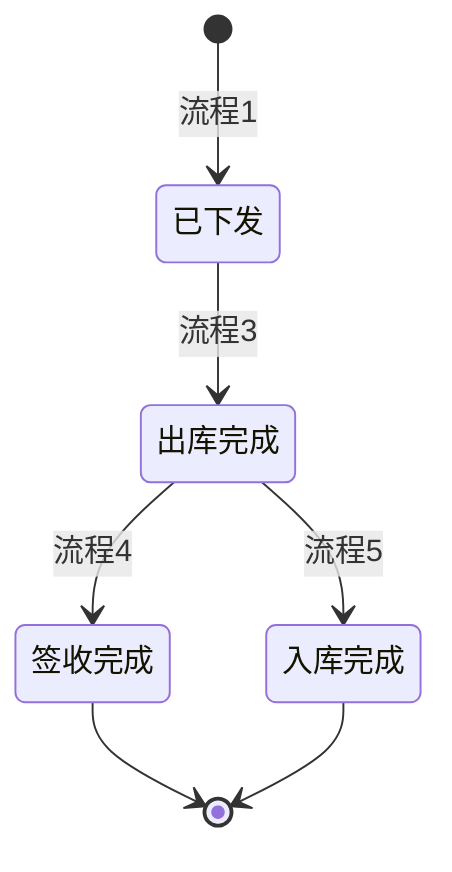
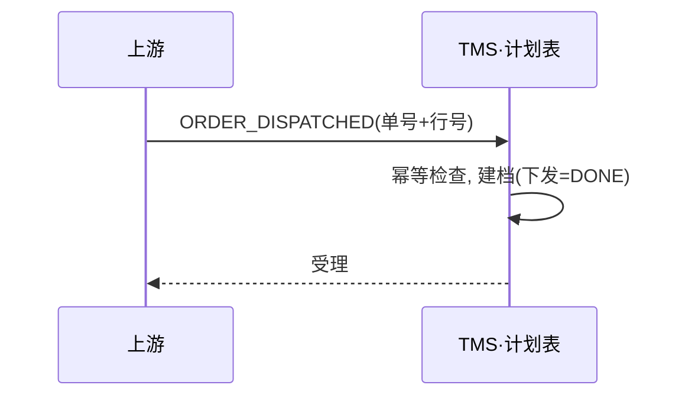
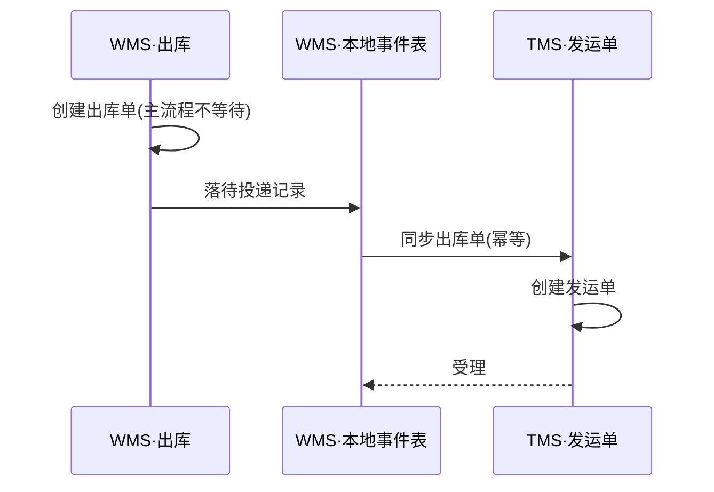
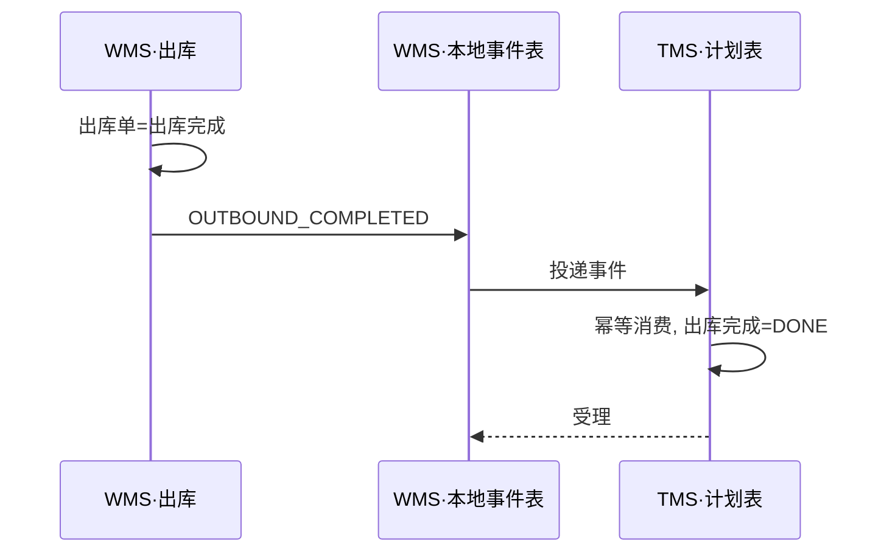
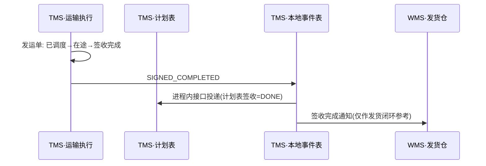
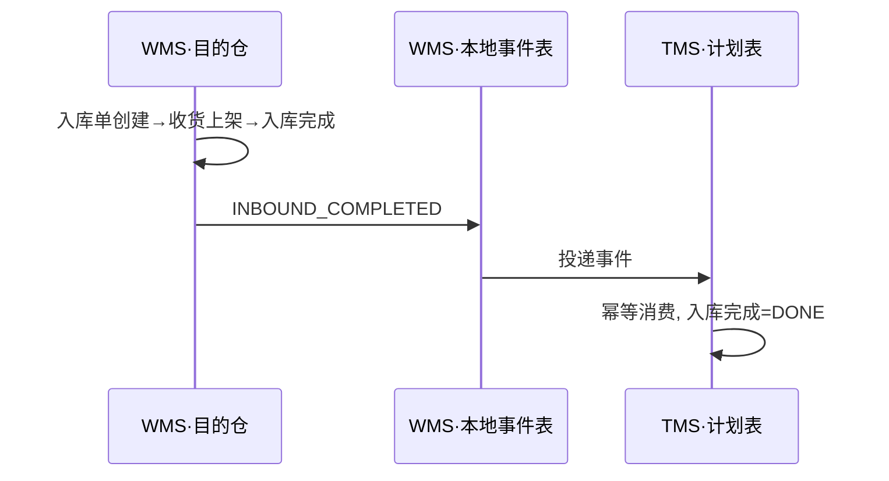

# 04 核心业务流程（骨架版）

## 目录

- [0. 主单节点链](#0-主单节点链)
- [流程 1：上游下发运输需求](#流程-1上游下发运输需求)
- [流程 2：WMS 出库单同步 TMS 创建发运单](#流程-2wms-出库单同步-tms-创建发运单)
- [流程 3：出库完成，更新计划表](#流程-3出库完成更新计划表)
- [流程 4：TMS 调度、发运、签收](#流程-4tms-调度发运签收)
- [流程 5：目的仓收货入库](#流程-5目的仓收货入库)
- [流程 6：取消与变更](#流程-6取消与变更)

> 本文只固化**已决策的链路顺序与参与方**；异常分支、字段级校验、状态机细节在联调期逐步补全（补全清单见 [README](README.md)）。消息契约与幂等规范见 [06-api-contracts.md](06-api-contracts.md)。WMS 为**外部参与方**（[ADR-003]）。

---

## 0. 主单节点链

节点状态只前进（[ADR-013]）；取消/冲销为叠加的独立标记，不回退节点。

## 流程 1：上游下发运输需求

- 建档不建运单/发运单，运输执行由流程 2 触发。
- 单号规则见 [05] §4。

## 流程 2：WMS 出库单同步 TMS 创建发运单

- TMS 失败不阻塞 WMS 出库（[ADR-014]），重试兜底。
- 发运单不写计划表（[ADR-007]）。

## 流程 3：出库完成，更新计划表

- 重复/迟到事件幂等吞掉；失败重试耗尽 → 告警。

## 流程 4：TMS 调度、发运、签收

- TMS 签收 ≠ 目的仓收货，允许差异（[ADR-008]）。
- 异常签收记在运输执行域，计划表不加异常列（[10] R-2）。

## 流程 5：目的仓收货入库

- 入库单由目的仓 WMS 自主创建；实收数量差异记录在入库单（处理规则 `[待补全]`）。

## 流程 6：取消与变更

- 原则：**谁先收到变更，谁发出事实**；ORDER_CANCELLED / ORDER_CHANGED 按 [06] 契约广播，各系统按自身状态处理。
- TMS 处理：发运单未调度 → 取消发运单；已在途 → 线下拦截流程 `[待定]`，系统内记录取消申请。
- 处理矩阵（各方 × 各自状态）`[待补全]`：随各系统状态机细化时补入。
