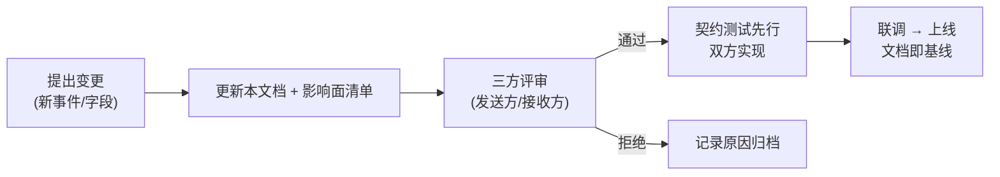

# 06 接口与事件契约

## 目录

- [1. 契约总则](#1-契约总则)
- [2. 事实与命令的区分](#2-事实与命令的区分)
- [3. 事件信封](#3-事件信封)
- [4. 事件字典](#4-事件字典)
- [5. 查询类 API 清单](#5-查询类-api-清单)
- [6. 幂等消费规范](#6-幂等消费规范)
- [7. 响应语义与错误分类](#7-响应语义与错误分类)
- [8. 重试、退避与补偿](#8-重试退避与补偿)
- [9. 版本与兼容性](#9-版本与兼容性)
- [10. 安全与鉴权](#10-安全与鉴权)
- [11. 契约变更流程](#11-契约变更流程)

---

## 1. 契约总则

1. **查询走同步 API，业务事实走事件语义接口**（[ADR-010]）。
2. 当前传输层为 HTTP 同步调用，但**语义上是"事件传输层"**：接收方记录事实并返回受理结果，不反向驱动调用方流程；未来切 MQ/事件总线时，只替换传输适配层，信封、幂等、重试语义不变。`[未来演进]`
3. 所有事实类接口必须满足 [ADR-011] 的可靠性要求：发送方本地事件表、接收方幂等消费、失败重试——契约评审时逐项检查。
4. 契约以本文档为唯一事实源：先改文档、评审通过，再实现；接口与文档不一致按缺陷处理。
5. 跨系统关联键一律 `biz_order_no + line_no`；任何接口不得要求对方提供其主权数据之外的"内部 ID"作为关联键。

## 2. 事实与命令的区分

| 类别 | 语义 | 例子 | 接收方义务 |
|---|---|---|---|
| **事实（Fact）** | "已经发生了什么"，不可拒绝，只可幂等记录 | 出库完成、签收完成、订单取消 | 落库 + 返回受理；处理结果不回传驱动对方 |
| **命令（Command）** | "请你做什么"，可被业务规则拒绝 | 同步出库单→创建发运单 | 校验 + 幂等执行；拒绝需返回明确业务错误码 |

规则：
- 事实类接口**不允许返回业务拒绝**（数据非法除外）——已经发生的事不能被"不同意"。
- 命令类接口尽量少；新增命令必须论证为什么不能建模为事实（防点对点命令蔓延，[ADR-010]）。
- "订单取消"是事实广播：各系统按自身状态机决定如何处理（[04] 流程 8），发起方不等待、不编排各方结果。

## 3. 事件信封

所有事实类消息共用统一信封（payload 结构见 §4）：

| 字段 | 类型 | 必填 | 说明 |
|---|---|---|---|
| event_id | string(UUID) | ✓ | 全局唯一；**重试时不变**（幂等去重主键之一） |
| event_type | string | ✓ | 见事件字典，大写下划线命名 |
| occurred_at | datetime | ✓ | 业务发生时间（非发送时间） |
| source_system | string | ✓ | WMS / TMS / UPSTREAM / STL |
| biz_order_no | string | ✓ | 业务单号 |
| line_no | int | ✓ | 行号（单头级事件填 0 `[待定]`：是否允许单头事件） |
| aggregate_version | int | ✓ | 同一单行的事实版本号，接收方丢弃旧版本 |
| payload | object | ✓ | 事件明细 |
| trace_id | string | — | 链路追踪 `[待定]` |

## 4. 事件字典

| 事件类型 | 类别 | 发送方 → 接收方 | 触发时机 | payload 要点 | 幂等去重键 |
|---|---|---|---|---|---|
| ORDER_DISPATCHED | 事实 | 上游 → TMS(计划表) | 运输需求下发 | order_type、ship_from/to、plan_qty、required_date、source_doc_no | event_id+单号+行号+类型；接口单幂等另用 source_doc_no+行号 |
| OUTBOUND_ORDER_SYNC | **命令** | WMS → TMS | 出库单创建成功 | 出库单号、明细(物料/批次/数量)、收货方 | 出库单号+单号+行号 |
| OUTBOUND_COMPLETED | 事实 | WMS → TMS(计划表) | 出库单作业完成 | 出库单号、实发数量、完成时间 | 同左通用键 |
| INBOUND_COMPLETED | 事实 | WMS(目的仓) → TMS(计划表) | 入库单收货完成 | 入库单号、实收数量、完成时间 | 同左 |
| SIGNED_COMPLETED | 事实 | TMS → WMS(发货仓)、计划表(进程内) | 签收登记完成 | 运单号、签收时间、签收人、凭证附件ID、异常标记 | 同左 |
| ORDER_CANCELLED | 事实 | 先收到变更方 → 其余各方 | 取消确认 | 原因、发起方、取消时点各节点状态快照 | 同左 |
| ORDER_CHANGED | 事实 | 先收到变更方 → 其余各方 | 变更确认 | 变更字段集、变更前后值、版本 | 同左 |

> 新增事件 = 新增 ADR 级评审（防事件字典膨胀为隐性问题域）。

## 5. 查询类 API 清单

| API | 提供方 | 消费方 | 用途 |
|---|---|---|---|
| 计划单状态查询（按业务单号+行号 / 按时间窗） | TMS | 履约视图、上游、客服 | 主单四节点状态 |
| 出库单/入库单查询 | WMS | 履约视图、TMS(排障) | 仓内进度补充 |
| 发运单/运单查询 | TMS | 履约视图、WMS(排障) | 运输执行进度 |
| 库存现存量查询 | WMS | 上游 `[待定]` | — |

查询 API 规则：只读、分页强制（页大小上限）、支持按业务时间窗过滤；不提供"批量修改"类端点。

## 6. 幂等消费规范

1. 去重键 = `event_id + biz_order_no + line_no + event_type`，落收件箱表唯一约束（[05] §3.2）。
2. 消费逻辑与幂等记录在**同一本地事务**提交。
3. 重复事件：返回 200 + 首次处理结果摘要，**不重复执行业务**。
4. 乱序/旧版本：`aggregate_version` 小于已记录版本 → 丢弃并记日志（状态只前进，[ADR-013]）。
5. 消费失败（本地异常）：返回可重试错误，事件保留在发送方 outbox 继续重试；接收方不写幂等记录。

## 7. 响应语义与错误分类

| HTTP/业务码 | 语义 | 发送方动作 |
|---|---|---|
| 2xx（受理/重复受理） | 成功 | outbox 标记 SENT |
| 4xx-业务拒绝（仅命令类） | 数据非法/业务规则拒绝 | **不重试**，转人工 + 告警 |
| 4xx-鉴权/格式错误 | 契约问题 | 不重试，报缺陷 |
| 5xx / 超时 / 网络错误 | 可重试 | 进入退避重试 |

## 8. 重试、退避与补偿

- 退避序列（默认，可按事件覆写）：1min → 5min → 30min → 2h → 6h，共 5 次；耗尽置 DEAD + 告警（[ADR-016] 期间已拍板默认值，上线后可调）。
- 重试耗尽：outbox 置 DEAD + 告警；人工介入后可**重推**（event_id 不变，依赖接收方幂等）。
- 丢失检测兜底：DEAD 事件对应事实的比对/补偿机制 `[待定]`。
- 补偿动作本身必须幂等：重推复用原 event_id，依赖接收方幂等。

## 9. 版本与兼容性

1. payload **只增不改不删**：新增字段必须可选，接收方忽略未知字段。
2. 破坏性变更 = 新事件类型（如 `OUTBOUND_COMPLETED_V2`）并行双发过渡期 `[待定]`，禁止原地改语义。
3. URL/Header 携带契约版本号的机制 `[待定]`（随网关/鉴权选型确定）。

## 10. 安全与鉴权

- 系统间调用鉴权：**Token**（`[已决策 2026-10-04]`，[ADR-016]）；签发与校验机制随网关/基础设施落地细化 `[待定]`。
- **约束先行**：系统间接口不暴露公网；履约视图对客服侧的访问控制随权限方案 `[待定]`。

## 11. 契约变更流程

