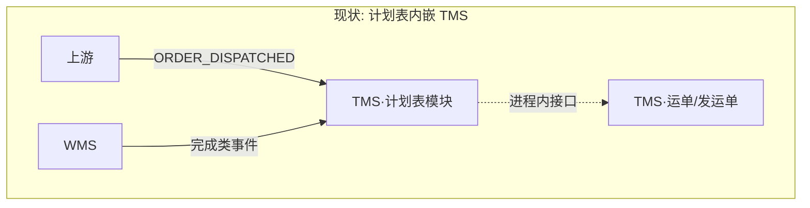
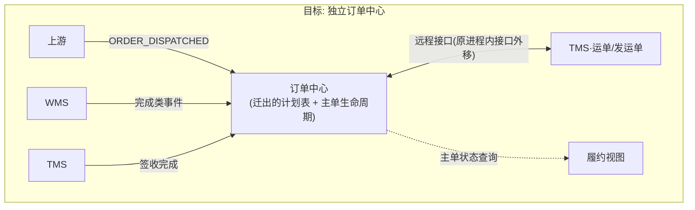

# 09 订单中心迁移路径 [未来演进]

## 目录

- [1. 定位与触发条件](#1-定位与触发条件)
- [2. 现状与目标架构](#2-现状与目标架构)
- [3. 现在就执行的迁移前置纪律](#3-现在就执行的迁移前置纪律)
- [4. 迁移步骤](#4-迁移步骤)
- [5. 流量切换与灰度](#5-流量切换与灰度)
- [6. 各系统改造清单](#6-各系统改造清单)
- [7. 风险与回滚](#7-风险与回滚)
- [8. 验收清单](#8-验收清单)

---

## 1. 定位与触发条件

计划表（[05] §2）= 订单中心雏形（[ADR-015]）。迁移是**已确认方向**，但**不设时间表**——满足以下任一触发条件再启动评估：

| 触发条件 | 信号 |
|---|---|
| 协调范围超出四节点 | 业务要求管理主单更多生命周期节点，且现有系统之外出现新参与系统 |
| TMS 被协调逻辑拖累 | 计划表相关变更频繁牵动 TMS 发布；TMS 运输执行迭代被阻塞 |
| 多业务线接入 | 第二条业务线（如跨境、逆向）需要复用主单协调，且规则分叉 |
| 团队与运维就绪 | 具备独立团队的维护能力与高可用运维能力（订单中心成为全链路单点，可用性要求最高） |

> 反向保护：在迁移之前，红线 [10] R-2/R-8 持续生效——计划表不膨胀，防止"隐性订单中心"以不可迁移的形态长大。

## 2. 现状与目标架构

**不变量**（迁移的锚点）：
1. TMS 运单表结构与运输执行业务逻辑**不动**。
2. 跨系统关联键（业务单号+行号）不动。
3. 事件字典与信封（[06]）不动——WMS/上游只是把事件投递目标从 TMS 切到订单中心。

## 3. 现在就执行的迁移前置纪律

| 纪律 | 依据 | 验收方式 |
|---|---|---|
| 计划表与运单表零 join、零跨表 update，联动全走接口 | [ADR-006] | 架构测试/SQL 审计（[10] 检测手段） |
| 计划表只存四节点，不新增业务列 | [ADR-007] | 新增字段必须过架构评审 |
| 计划表模块独立代码边界（独立模块/包，可整体搬走） | [ADR-004] | 代码结构评审 |
| 所有外部事件按 [06] 信封契约投递，目标地址可配置 | [ADR-010] | 契约测试 |
| 计划表读写全部经模块接口，TMS 其他模块不得直读计划表表 | [ADR-006] | 架构测试 |

## 4. 迁移步骤

| 步骤 | 内容 | 退出标准 |
|---|---|---|
| M1 | 订单中心作为新单体立项（独立库）；数据模型以计划表为基线扩展；对外契约复制 [06] 事件字典 | 契约测试通过 |
| M2 | 存量计划表数据迁移（全量+增量追平）；迁移工具幂等、可重跑；逐行校验（关联键+四节点状态+版本） | 校验差异=0 |
| M3 | 上游/WMS 事件**双投**（TMS 计划表 + 订单中心），订单中心只写不读；每日比对两侧状态一致性 | 连续 N 天一致率 100%（N `[待定]`） |
| M4 | 履约视图、上游主单查询切换到订单中心；TMS 计划表仍接收事件（回滚保底） | 查询侧无回归 |
| M5 | TMS 运单联动从"进程内调用计划表模块"改为"远程调用订单中心"；停止 TMS 计划表写入 | 联动链路回归通过 |
| M6 | TMS 计划表转只读封存（保留时长 `[待定]`）→ 归档下线 | 封存期内无缺陷引用 |

## 5. 流量切换与灰度

- **灰度维度**：按业务线 / 发货仓 / 单号段（biz_order_no 规则内切流 `[待定]`）分批双投→切读→切写。
- **双写期一致性**：以 TMS 计划表为基准比对（M3），差异自动告警并阻断该灰度批次推进。
- **切流开关**：事件投递目标、查询路由、联动调用目标全部配置化，支持按灰度批次独立回切。
- 不建议"一刀切"：订单中心是全链路协调单点，灰度期必须保留 TMS 计划表热备。

## 6. 各系统改造清单

| 系统 | 改造 | 不改造 |
|---|---|---|
| TMS | 计划表模块下线（M6）；运单联动接口从进程内改远程（M5）；事件进程内投递改远程 | 运单/发运单表结构、运输执行业务逻辑（[ADR-015] 锚点） |
| WMS | 事件投递目标增加/切换订单中心（配置化路由） | 事件契约、出库/入库流程 |
| 上游 | 下发/取消/变更事件目标切换 | 单号规则、事件语义 |
| 履约视图 | 数据源从 TMS 计划表切订单中心 | 只读定位 |

## 7. 风险与回滚

| 风险 | 影响 | 缓解 |
|---|---|---|
| 订单中心成为全链路单点 | 可用性要求跃升 | 独立高可用部署方案先行评审；M3–M5 期间 TMS 计划表热备 |
| 双写不一致 | 主单状态分裂 | 每日自动比对 + 差异阻断灰度；不一致期间以 TMS 计划表为准（基准方） |
| 存量迁移错漏 | 历史主单状态失真 | M2 逐行校验 + 迁移幂等可重跑；迁移窗口冻结计划表写入（分钟级） |
| TMS 远程联动引入时延/故障 | 运输执行受影响 | 联动接口异步化 + 降级策略（订单中心不可用时运输执行照常，协调状态延迟收敛）——延续 [ADR-014] 思想 |
| 团队能力不匹配 | 迁移烂尾 | M0 把"独立维护能力"列为立项门槛，不满足不启动 |

**回滚方案**（每阶段独立可回滚）：
- M3/M4 回滚：切流开关回切 TMS 计划表（双写期 TMS 侧数据始终最新，零数据回补）。
- M5 回滚：TMS 联动恢复进程内调用；订单中心转只读。回滚前提：M6 之前 TMS 计划表写入链路保持可用。
- M6 后不可回滚：因此 M6 必须晚于约定的封存观察期 + 相关方确认。

## 8. 验收清单

- [ ] 全部 [06] 事件在订单中心幂等消费，契约测试通过
- [ ] 存量迁移逐行校验差异 = 0
- [ ] 双写比对连续达标（一致率 100%，天数按灰度计划）
- [ ] 履约视图/上游查询切换后回归通过
- [ ] TMS 运输执行回归通过（运单表零改动证明：schema diff 为空）
- [ ] 回滚演练至少执行一次（M4 前回切）
- [ ] 旧计划表封存只读，归档策略落定
