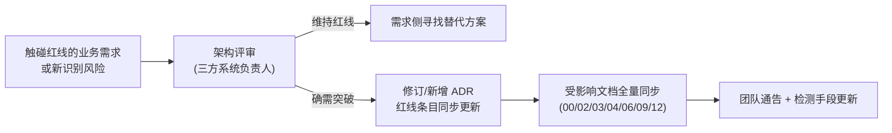

# 10 风险、红线与禁止事项

## 目录

- [1. 架构红线](#1-架构红线)
- [2. 红线检测手段](#2-红线检测手段)
- [3. 风险矩阵](#3-风险矩阵)
- [4. 禁止事项速查](#4-禁止事项速查)
- [5. 红线与风险的变更流程](#5-红线与风险的变更流程)

---

## 1. 架构红线

红线 = 无条件禁止项。任何代码评审、方案评审中发现触碰红线，**一票否决**；确需突破必须先修订 ADR（§5）。

| # | 红线 | 依据 | 触碰后果 |
|---|---|---|---|
| R-1 | 计划表不得直接 join 或 update TMS 运单表（反向同样禁止），联动只走接口 | [ADR-006] | 订单中心迁移路径被毁（[09]），TMS 内部耦合成团 |
| R-2 | 计划表不得膨胀为全链路状态机：只存四节点，不新增仓内/运输作业细节字段 | [ADR-007] | 计划表变成不可迁出的巨型状态表，协调职责与执行职责混淆 |
| R-3 | 外部系统不得直接读取 TMS 业务库（含只读账号直连），数据访问只经契约接口 | [ADR-003] | 业务库被外部查询拖垮；绕过契约口径 |
| R-4 | WMS 出库主流程不得被 TMS 等外部系统阻塞（同步等待、强依赖均违规） | [ADR-014] | 变更最频繁、可用性要求最高的仓内作业被外部系统拖死 |
| R-5 | 不得无幂等地做异步或批处理（本地事件表/幂等消费/重试缺一不上线） | [ADR-011] | 数据丢失/重复不可发现、不可修复 |
| R-6 | 不得按"原材料仓、成品仓、线边仓"拆微服务 | [ADR-003] | 数据同步与运维成本爆炸，仓型规则碎片化 |
| R-7 | 不得在团队、运维、数据核验能力不具备时硬拆微服务 | [ADR-001] | 分布式复杂度反噬业务交付 |
| R-8 | 不得把 TMS 计划表当作隐性订单中心无边界扩张（新协调需求默认拒收，触发 [09] §1 评估） | [ADR-002/015] | "临时方案"永久化，迁移成本随时间指数上升 |

> **约束对象**：R-1/R-2/R-4/R-5/R-8 约束 TMS（本项目）；R-3/R-6/R-7 为全生态集成纪律，约束对象含 WMS 等外部建设方，本项目在集成契约中声明传递（[03] §3）。

## 2. 红线检测手段

| 红线 | 检测方式 | 时机 |
|---|---|---|
| R-1/R-2 | 架构测试（ArchUnit 1.5.1 依赖规则断言，`ArchRules.planAndExecutionMustNotShareInternals` + `R2PlanTableFieldWhitelistTest`）+ 计划表 DDL 变更强制评审 + SQL 审计扫描跨前缀 join | CI / 发布前 / 例行审计 |
| R-3 | 数据库账号权限矩阵审查（外部系统账号对 TMS 业务库零授权）+ 网络策略 | 上线前 + 季度审查 |
| R-4 | 集成测试含故障注入用例：TMS 宕机时 WMS 出库全流程必须成功（事件滞留 outbox） | CI / 发布前 |
| R-5 | 集成上线检查单（幂等/重试逐项签核）；事件投递监控（DEAD/重试率） | 方案评审 + 上线门禁 |
| R-6/R-7 | 架构评审门禁：任何新服务立项必须附 ADR + 能力评估 | 立项时 |
| R-8 | 计划表字段数/接口数趋势监控（超阈值告警）+ 需求评审默认拒收 | 需求评审 / 季度架构复盘 |

## 3. 风险矩阵

| # | 风险 | 概率 | 影响 | 缓解措施 | 预警信号 |
|---|---|---|---|---|---|
| K-1 | 跨系统事件丢失/重复（集成缺陷） | 中 | 高 | [ADR-011] 可靠性机制 + DEAD 告警 | outbox DEAD 数、dup 率突增 |
| K-2 | 业务单号规则不一致（上游多源） | 中 | 高 | 单号规范评审（[05] §4）；入口校验拒绝非法单号；D-1 尽快落定 | 建档失败率、无法匹配行占比 |
| K-3 | 计划表被业务需求逐步撑大 | **高** | 高 | R-2/R-8 红线 + 字段趋势监控 + 需求默认拒收 | 计划表列数/接口数增长 |
| K-4 | 团队边界纪律退化（跨模块直查、事实接口命令化） | 高 | 中 | 架构测试进 CI；契约评审（[06] §11）；红线培训入新人手册 | 评审违规次数趋势 |
| K-5 | 签收与入库长期不收敛（现场执行差异） | 中 | 中 | 收敛期监控与升级机制 `[待定]` | 长期未闭环单据存量 |
| K-6 | 订单中心迁移期双写不一致 | 低（迁移期） | 高 | [09] §5 比对阻断 + 分阶段回滚 | 双写比对差异告警 |

## 4. 禁止事项速查

开发日常"十不做"（张贴级）：

1. 不在计划表和运单表之间写 join / 直接 update（R-1）。
2. 不给计划表加"顺手"字段（R-2）。
3. 不给外部系统开 TMS 业务库账号（R-3）。
4. 不在 WMS 出库事务里同步调外部接口（R-4）。
5. 不上线没有幂等键的异步/批处理（R-5）。
6. 不新建按仓型划分的服务/独立代码库（R-6）。
7. 不用"先拆了再说"的理由引入中间件（R-7 / [ADR-016]）。
8. 不把事实接口写成命令语义（"请你取消"），取消是广播事实（[06] §2）。
9. 不用内部自增 ID 做跨系统关联，只用业务单号+行号（[ADR-012]）。
10. 不回退已完成状态、不物理删除事实记录（[ADR-013] / [05] §1）。

## 5. 红线与风险的变更流程

- 风险矩阵每季度复盘一次：更新概率/影响评估，关闭已消除项，新增识别项。
- 红线条目只增不删；废弃红线保留编号并标注废弃原因与日期。
